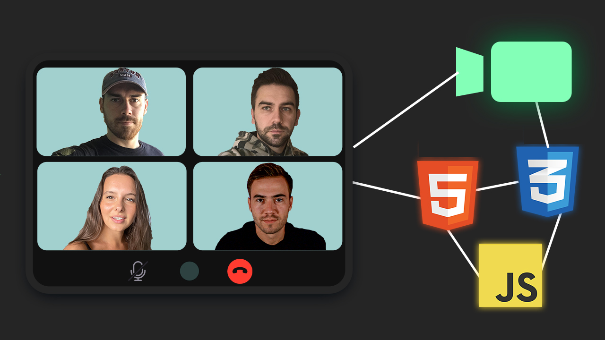

# group-video-chat
Simple group video chat app built using plain HTML, CSS, JavaScript and the Agora SDK

# Installation
* 1 - clone repo [https://github.com/divanov11/group-video-chat](https://github.com/Mustafa-Esmaail/test-video/tree/sign-video)
* 2 - Create an account on agora.io and get APP ID, Temp Token and Channel Name
* 3 - Update APP ID, Temp Token and Channel Name in script.js

# Projects Page
  
